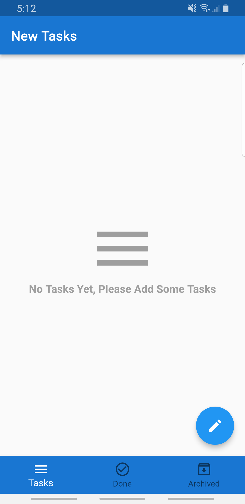
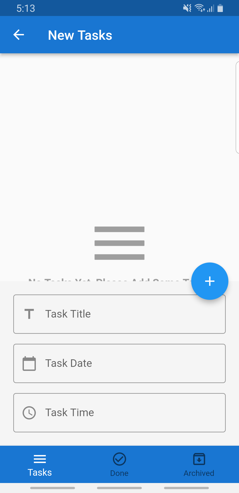
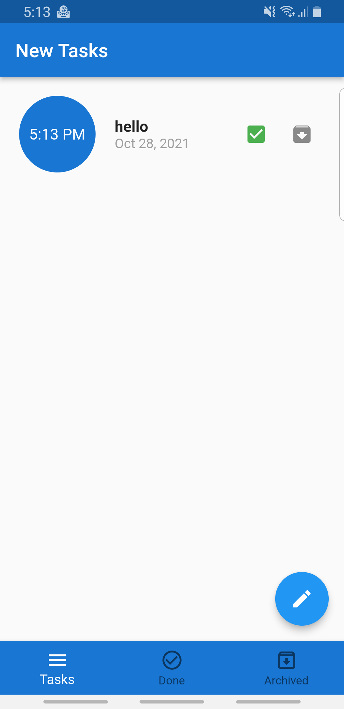
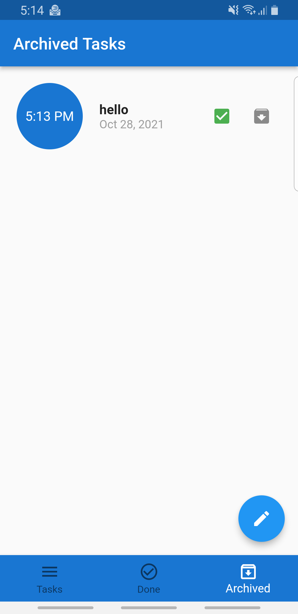

# noon_clone

This is a notes application. I made it to learn the all basics of the SQL-lite database and State Management (Bloc).It is very simple and easy to use. The main idea of the application is to store the user notes as tasks to help him managing his time. Also he sets a deadline to end this task and the application shows him if the task had done or not.

## Tools

- Backend: SQL-lite Database
- State management:
    - Bloc Design Pattern

- Packages:
    - bloc
    - flutter_bloc
    - intl
    - sqflite
    - conditional_builder_null_safety
    
## Screenshots

<table>
  <tr>
    <td></td>
    <td></td>
    <td></td>
  </tr>
 </table>

<table>
  <tr>
    <td></td>
  </tr>
 </table>

